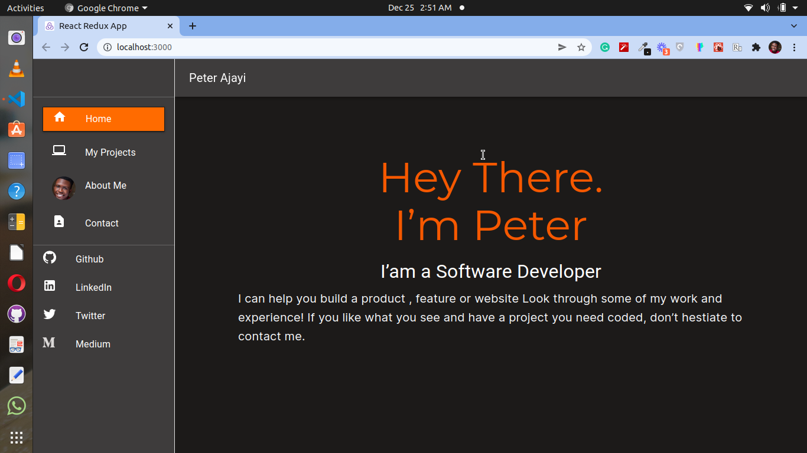

# Personal Portfolio Website

This is my personal portfolio website, this gives an information about what I am passionte about and showcase my skills as a software developer.
  

## Live demo
[ajayipeter](https://crypto-metrics-d.netlify.app)

## Built With

- React

- CSS

- Boostrap
  
- Material Ui

- Visual Studio Code

- Git & Github

## Getting Started
To get a local copy up and running follow these simple example steps.

### Setup
* Open terminal
* Clone this project by command git clone(https://github.com/peterdgreat/My-Personal-Website.git)
* Cd Crypto-Metrics

### install
Run the following command to have all npm packages dependencies installed:

npm install

### Usage

To start the webpack-dev-server, run the following command:

npm run start

## Authors

👤 **Ajayi Peter**

- GitHub: [@peterdgreat](https://github.com/peterdgreat)
- Twitter: [@dev_Peter_0](https://twitter.com/dev_Peter_O)
- LinkedIn: [ajayipeter](https://linkedin.com/in/ajayipeter)

## Show your support

Give a ⭐️ if you like this project!

## Acknowledgments
- Hat tip to anyone whose code was used
- Inspiration
- etc

# Credits
Credits: Nelson Sakwa

License: Nelson Sakwa
